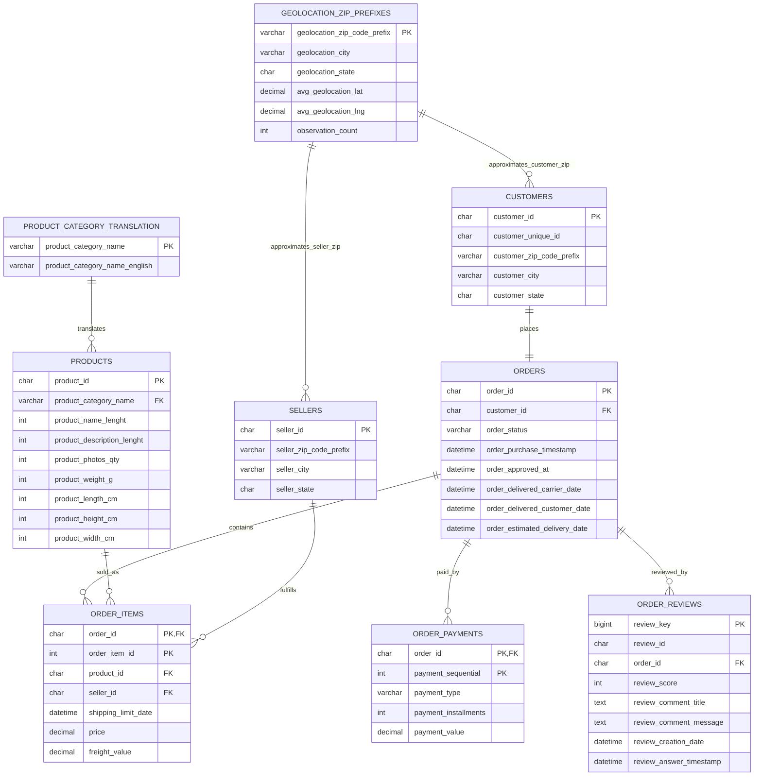

# ER Diagram

This document describes the main analytical-table relationships used in the E-Commerce Sales Analytics Dashboard project.

## Notes

- `order_reviews.review_id` is preserved as a source identifier, but `review_key` is the analytical primary key because raw review IDs are duplicated.
- `geolocation_zip_prefixes` is an aggregated lookup table, not a strict raw-grain dimension.
- Zip code prefix relationships are analytical lookup relationships and are not enforced as foreign keys in the schema.
